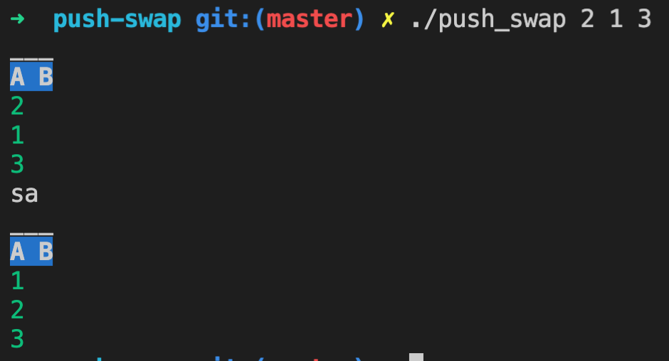

# push-swap
Number Stack Sorting algorithm - An approach focused on predicting and reducing commands on every execution

In this project we are asked to sort a stack of numbers using only a series of operations, which may or may not interact with a second stack b:

#### ra we rotate the next number to the top
| a | a |
| - | - |
| 1 | 2 |
| 2 | 3 |
| 3 | 1 |

#### rra we rotate the last number to the top

| a | a |
| - | - |
| 1 | 3 |
| 2 | 1 |
| 3 | 2 |

rb and rrb are the same operations as above but for stack b

rr and rrr are the same operations as above for stack a and b at the same time

pb we push the top number from a to b

| a | a | b | 
| - | - | - |
| 1 | 2 | 1 | 
| 2 | 3 |   |
| 3 |

and pa we push the top number from b to a

sa sb and ss we swap the first 2 numbers of the stack

| a | a |
| - | - |
| 1 | 2 |
| 2 | 1 |
| 3 | 3 |

So after we `make` on the project root we can type `./pushswap 2 1 3` and we expect to see a single command being printed out to stdout `sa\n`
___

### Summary

1. [Strategy Summary](#1-strategy-summary)
___

### 1. Strategy Summary

I saw many implementations were if you have 3 numbers then you sort in a way and if you have 5 you sort in a different way and if you have 10 in another way.

I didn't like this concept. I wanted to create a series of rules that allow me to choose between the different operations.

So taking into consideration that we have only 2 stacks to organize these are the main thing I focused on:

1. There will be more and more rotates in a and b and that is where most moves will come from so double rotations can be really useful.
2. Once a is in ascending order we only need to rotate it. It is impossible to have less moves then just rotating the ramp. So our priority is making
a in ascending order so we can rotate it.
3. If we place the a numbers in b in descending order then we will only need to push them back to a with no extra rotate bs
4. Swapping is almost always better than pushing (depending on how many rotates are needed to get to the swapping place.
5. Pushing from b to a before a is in ascending order might potentially increase the rotates in a unnecessarily so it is better to just push them after
6. As the number of numbers increases then rotates in b will also increase and we will need to adjust our strategy.
